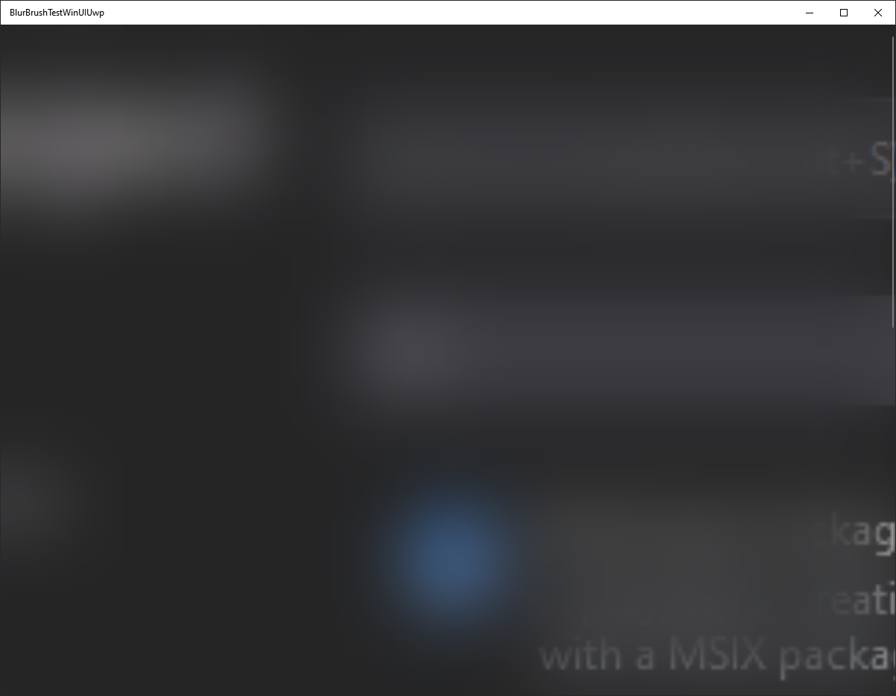

# WinUI 3 Preview 2 Blur Brush Bug Around Window Border

This repo reproduces a bug in WinUI 3 Preview 2 where Win2D blur brush around window border has a gradient masked effect. To prove uwp doesn't have this bug a uwp project with the exact same code is also included.

Folder structure:
- `BlurBrushTestUwp`: This is the control project: UWP doesn't have this bug.
- `BlurBrushTestWinUI3Preview2Uwp`: This is the WinUI 3 Preview 2 project which can reproduce the bug.

**Note**: The bug appears in WinUI regardless of effect border mode/sprite visual border mode. In UWP, the blur works fine regardless of either mode as well.

**Steps to reproduce**
1. Build the project in `BlurBrushTestWinUI3Preview2Uwp`.
2. Observe blur around the window border has a gradient masked effect.

**Expected Result**

WinUI blur brush is the same as UWP blur brush.

**Actual Result**

WinUI blur brush has a weird masked gradient effect around window border.

**Version**
Windows 10 2004

**Screenshots**

UWP:

WinUI 3 Preview 2
